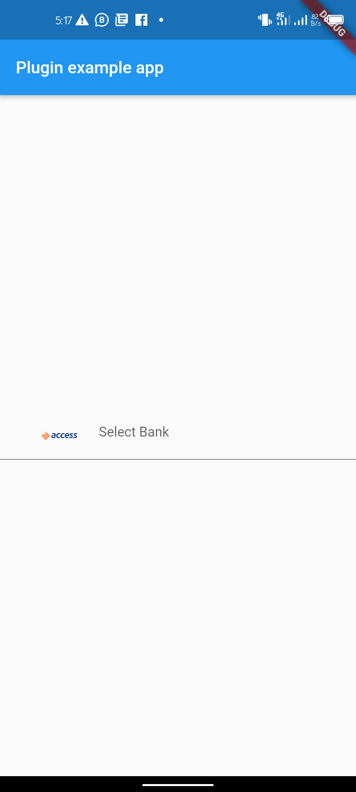
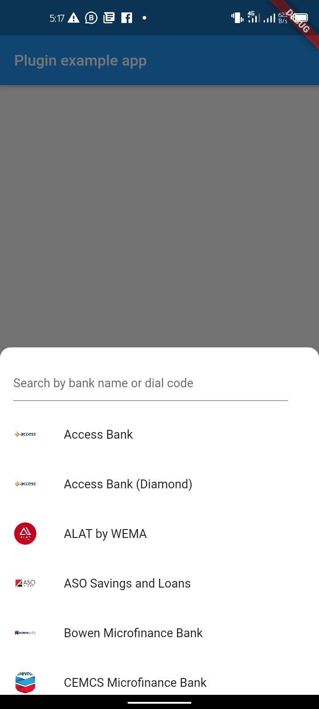
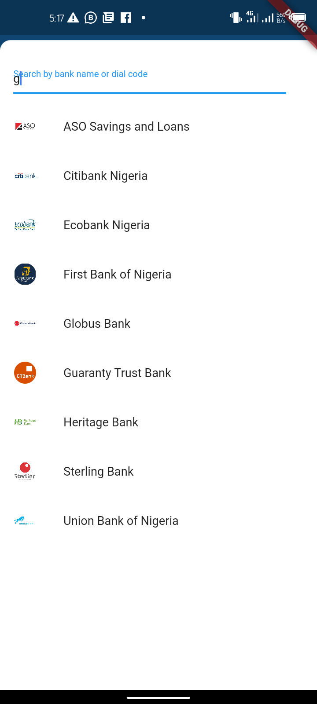

# nigerian_banks

A simple ( maybe not :sleepy:) plugin for adding nigerian banks to your forms..... it's all vibes and inshallah, but it works good ( if it doesn't do what you are looking for, feel free to report an issue :unamused: or just fork the damn thing :stuck_out_tongue_winking_eye:)

### Screenshots
|  |  |  |

### What's new
  - Added list of banks and their logo ( it's 39 right now feel free to add more in lib/models/banks_list.dart) and oh don't forget to add logo into assets/images :innocent:
  - Search widget with modes,

### Features
  - Selector (dropdown, bottom sheet and dialog modes)
  - Search

# Usage

### Constructors

| s/n | Constructor                                             |
| --- | ------------------------------------------------------- |
|  1  | Banks                                                   |

## Available Parameters

```dart
 Banks({
          Key key,
          @required this.onInputChanged,
          this.onInputValidated,
          this.onSubmit,
          this.onFieldSubmitted,
          this.validator,
          this.onSaved,
          this.textFieldController,
          this.keyboardAction,
          this.initialValue,
          this.hintText = 'Select Bank',
          this.errorMessage = 'Select a bank from the list',
          this.selectorButtonOnErrorPadding = 24,
          this.maxLength = 15,
          this.isEnabled = true,
          this.showLogo = true,
          this.autoFocus = false,
          this.autoFocusSearch = false,
          this.autoValidateMode = AutovalidateMode.disabled,
          this.ignoreBlank = false,
          this.bankSelectorScrollControlled = true,
          this.locale,
          this.textStyle,
          this.selectorTextStyle,
          this.inputBorder,
          this.inputDecoration,
          this.searchBoxDecoration,
          this.focusNode,
          this.banks,
          this.selectorConfig
  });
  enum BankInputSelectorType { DROPDOWN, BOTTOM_SHEET, DIALOG }
  BankModel({ this.name, this.slug, this.code, this.ussd, this.logo, });
  SelectorConfig({
      this.selectorType = BankInputSelectorType.BOTTOM_SHEET,
      this.showLogo = true, this.showCode,
      this.backgroundColor = Colors.white,
      this.bankComparator,
    });
```
## Parameters

| Parameter                       | Type                   |    Initial Value          |
|---------------------------------|------------------------|---------------------------|
| onInputChanged                  | function(BankModel)    |        null               |
| onSaved                         | function(String)       |        null               |
| onInputValidated                | function(bool)         |        null               |
| focusNode                       | FocusNode              |        null               |
| textFieldController             | TextEditingController  |   TextEditingController() |
| onSubmit                        | Function()             |        null               |
| keyboardAction                  | TextInputAction        |        null               |
| banks                           | List<BankModel>        |        null               |
| textStyle                       | TextStyle              |        null               |
| selectorTextStyle               | TextStyle              |        null               |
| inputBorder                     | InputBorder            |        null               |
| inputDecoration                 | InputDecoration        |        null               |
| initialValue                    | BankModel              |        null               |
| hintText                        | String                 |     Phone Number          |
| selectorButtonOnErrorPadding    | double                 |        24                 |
| maxLength                       | integer                |        15                 |
| isEnabled                       | boolean                |        true               |
| autoFocus                       | boolean                |        false              |
| autoValidateMode                | AutoValidateMode       | AutoValidateMode.disabled |
| errorMessage                    | String                 | Invalid phone number      |
| selectorConfig                  | SelectorConfig         | SelectorConfig()          |
| ignoreBlank                     | boolean                |       false               |
| searchBoxDecoration             | InputDecoration        |        null               |
| bankSelectorScrollControlled    | boolean                |        true               |


# Contributions
If you encounter any problem or the library is missing a feature feel free to open an issue. Feel free to fork, improve the package and make pull request.

# Contributors
<a href="https://github.com/ELEOS-MAP/nigerian_banks/graphs/contributors">
  
</a>

Made with [contributors-img](https://contrib.rocks).

# Dependencies

# Credits

A special thanks to:
<a href="https://github.com/ichtrojan/nigerian-banks/graphs/contributors">
  
</a>
for the [nigerian-banks](https://github.com/ichtrojan/nigerian-banks) repo

and to
<a href="https://github.com/natintosh/intl_phone_number_input/graphs/contributors">
   
</a>
for the [intl_phone_number_input](https://github.com/natintosh/intl_phone_number_input) repo


Made with [contributors-img](https://contrib.rocks).
